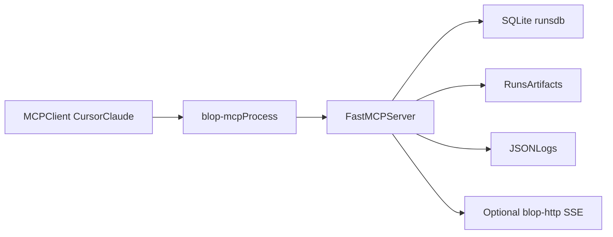

# blop MCP Production Setup (Local Managed `stdio`)

This guide is the production baseline for running `blop` as an MCP server with a
client-managed `stdio` transport (Cursor/Claude Code launching the process).

## 1) Recommended Architecture

- Primary transport: `stdio` (`blop-mcp` process is launched by the MCP client).
- Data plane: local SQLite (`BLOP_DB_PATH`) + artifact filesystem (`BLOP_RUNS_DIR`).
- Control and evidence: JSON logs (`BLOP_DEBUG_LOG`), run health events in DB.
- Optional sidecar: `blop-http` for SSE health streaming only.



## 2) Production Env Contract

Create a dedicated env file from `deploy/prod.env.template` and use absolute paths.

Required for production:

- `BLOP_ENV=production`
- `BLOP_REQUIRE_ABSOLUTE_PATHS=true`
- `BLOP_DB_PATH` absolute path
- `BLOP_RUNS_DIR` absolute path
- `BLOP_DEBUG_LOG` absolute path
- `BLOP_ALLOW_INTERNAL_URLS=false` (default-safe SSRF guard)
- `BLOP_CAPABILITIES_PROFILE=production_minimal` (or `production_debug` when needed)

Provider credentials:

- `GOOGLE_API_KEY` or
- `BLOP_LLM_PROVIDER=anthropic` + `ANTHROPIC_API_KEY` or
- `BLOP_LLM_PROVIDER=openai` + `OPENAI_API_KEY`

## 3) Capability Profiles (Least Privilege)

- `production_minimal`: `core,auth`
  - Use for release gate workflows and normal operation.
- `production_debug`: `core,auth,debug,analytics`
  - Use only during incident/debug windows.
- `full`: all groups including `compat_browser`
  - Use only for trusted migration/interoperability scenarios.

Keep `BLOP_ENABLE_COMPAT_TOOLS=false` unless you explicitly need the legacy `browser_*` surface.

## 4) MCP Client Configuration (Cursor example)

Use absolute paths in your MCP client config:

```json
{
  "mcpServers": {
    "blop": {
      "command": "/usr/local/bin/uv",
      "args": [
        "--directory",
        "/opt/blop-mcp",
        "run",
        "python",
        "-m",
        "blop.server"
      ],
      "env": {
        "BLOP_ENV": "production",
        "BLOP_REQUIRE_ABSOLUTE_PATHS": "true",
        "BLOP_DB_PATH": "/var/lib/blop/runs.db",
        "BLOP_RUNS_DIR": "/var/lib/blop/runs",
        "BLOP_DEBUG_LOG": "/var/log/blop/blop.log",
        "BLOP_CAPABILITIES_PROFILE": "production_minimal",
        "BLOP_ALLOW_INTERNAL_URLS": "false",
        "GOOGLE_API_KEY": "..."
      }
    }
  }
}
```

## 5) Host Prerequisites

- Python 3.11+
- `uv` installed
- Chromium runtime installed:
  - `playwright install chromium --with-deps --no-shell`
- Writable directories for:
  - DB parent directory
  - runs directory
  - log directory

## 6) Runtime Guardrails

Recommended defaults:

- `BLOP_RUN_TIMEOUT_SECS=1800` for bounded total run duration
- `BLOP_STEP_TIMEOUT_SECS=45` for bounded per-step replay execution
- `BLOP_ALLOW_SCREENSHOT_LLM=false` unless screenshots are approved for external model processing

URL safety:

- Internal/private URLs are blocked by default.
- For local-only development, set `BLOP_ALLOW_INTERNAL_URLS=true`.
- Optional stricter host policy: `BLOP_ALLOWED_HOSTS=staging.example.com,app.example.com`

## 7) Logging and Operations

- Logs are JSON lines with rotation (10 MB, 3 backups).
- Ingest `BLOP_DEBUG_LOG` into your log pipeline.
- Track at minimum:
  - run status transitions (`queued` -> `running` -> terminal)
  - run duration and timeout failures
  - tool-level exceptions by `tool` and `error_type`

## 8) Optional Sidecar: `blop-http` with systemd

If you want a stable SSE endpoint for run health streams, deploy `blop-http` as a managed service using `deploy/systemd/blop-http.service`.

## 9) Optional Container Baseline

For teams standardizing on containers, use `deploy/docker/Dockerfile` and run `blop-http` inside the container. Keep MCP `stdio` transport local/client-managed unless you intentionally move to a network-exposed MCP architecture.

## 10) Production Runbook (Short Form)

Startup:

1. Validate env file values and absolute paths.
2. Confirm Chromium availability.
3. Call `validate_release_setup(app_url=...)` from your MCP client.

If runs fail unexpectedly:

1. Check `BLOP_DEBUG_LOG` for `tool_exception` or `run_transition`.
2. Inspect run artifacts under `BLOP_RUNS_DIR`.
3. Re-run with debug capability profile only as needed.

Safe restart:

1. Stop issuing new MCP requests.
2. Let in-flight runs complete when possible.
3. Restart client-managed process (restart MCP client if needed).
4. Re-run `validate_release_setup`.
